# ModelMagic Dashboard - Complete Architecture & Implementation Plan

> **Document Version:** 1.0  
> **Date:** December 4, 2024  
> **Repository:** https://github.com/jalaura/modelmagic-dashboard/  
> **Prepared for:** Senior Web Developer (Gemini 3.0 Pro)

---

## Table of Contents

1. [Executive Summary](#1-executive-summary)
2. [System Architecture](#2-system-architecture)
3. [Technology Stack](#3-technology-stack)
4. [Data Models & Type Definitions](#4-data-models--type-definitions)
5. [Authentication System](#5-authentication-system)
6. [Routing & Navigation](#6-routing--navigation)
7. [State Management](#7-state-management)
8. [API Integration](#8-api-integration)
9. [UI/UX Architecture](#9-uiux-architecture)
10. [CI/CD Pipeline & Deployment](#10-cicd-pipeline--deployment)
11. [Current Implementation Status](#11-current-implementation-status)
12. [Step-by-Step Implementation Plan](#12-step-by-step-implementation-plan)
13. [Appendices](#13-appendices)
14. [Third-Party Integrations](#14-third-party-integrations)

---

## 1. Executive Summary

### 1.1 Project Overview

**ModelMagic Dashboard** is a comprehensive client and admin dashboard for a done-for-you product photography service. The platform enables:

- **Clients** to submit photography projects, track progress, manage assets, and collaborate with editors
- **Admins** to manage project queues, assign team members, track analytics, and manage client relationships

### 1.2 Key Features

| Feature | Description |
|---------|-------------|
| Magic Link Authentication | Passwordless login via email using Resend API |
| Role-Based Access Control | Separate client and admin interfaces with granular permissions |
| Project Management | Complete lifecycle from submission to delivery |
| Asset Management | Upload, organize, and deliver project assets |
| Real-time Updates | Live project status tracking |
| Responsive Design | Optimized for desktop, tablet, and mobile |

### 1.3 Architecture Philosophy

The application follows these architectural principles:

- **Component-Based Architecture** - Reusable React components
- **Type-Safe Development** - Full TypeScript coverage
- **Single Page Application** - React Router for client-side routing
- **Context-Based State Management** - React Context API for global state
- **Edge Deployment** - Cloudflare Pages for fast global CDN delivery
- **Serverless Backend** - Cloudflare Workers for API endpoints

---

## 2. System Architecture

### 2.1 High-Level Architecture Diagram

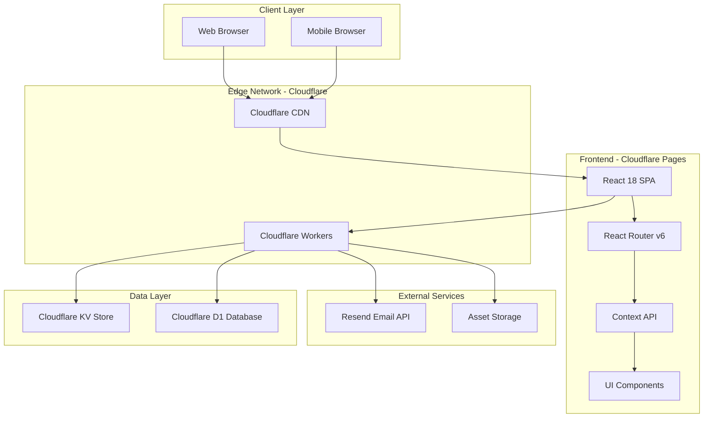

### 2.2 Frontend Architecture

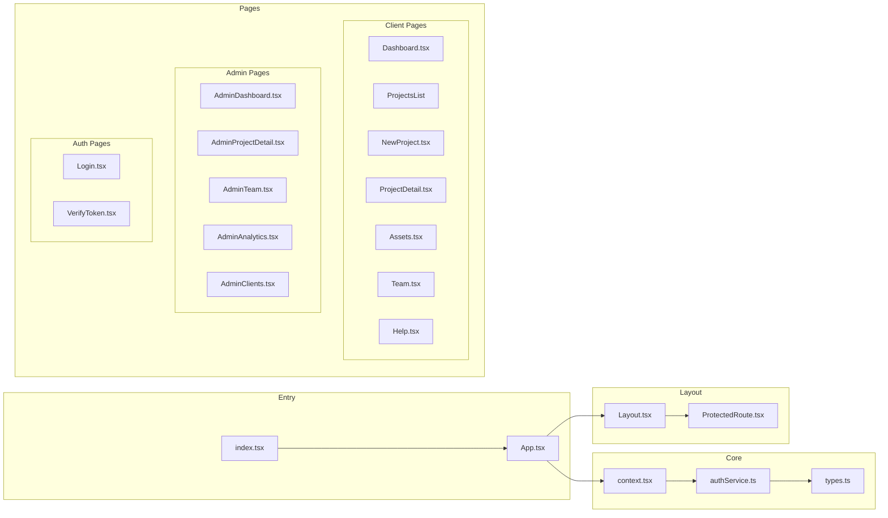

### 2.3 Request Flow

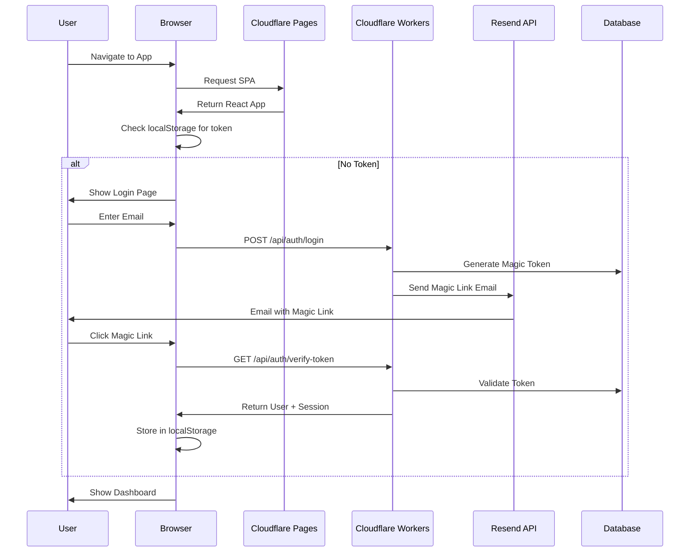

---

## 3. Technology Stack

### 3.1 Frontend Technologies

| Technology | Version | Purpose |
|------------|---------|---------|
| React | 18.2.0 | UI Library |
| TypeScript | 5.2.2 | Type-safe JavaScript |
| Vite | 5.2.0 | Build tool & dev server |
| React Router | 6.22.3 | Client-side routing |
| Tailwind CSS | Built-in | Utility-first CSS |
| Lucide React | 0.344.0 | Icon library |

### 3.2 Backend Technologies

| Technology | Purpose |
|------------|---------|
| Cloudflare Workers | Serverless API backend |
| Cloudflare KV | Key-Value storage for sessions |
| Cloudflare D1 | SQL database for data |
| Resend | Email service for magic links |

### 3.3 Development Tools

| Tool | Purpose |
|------|---------|
| ESLint | Code linting |
| Prettier | Code formatting |
| TypeScript | Static type checking |
| GitHub Actions | CI/CD pipeline |

### 3.4 Dependencies Structure

```json
{
  "dependencies": {
    "lucide-react": "^0.344.0",
    "react": "^18.2.0",
    "react-dom": "^18.2.0",
    "react-router-dom": "^6.22.3"
  },
  "devDependencies": {
    "@types/react": "^18.2.66",
    "@types/react-dom": "^18.2.22",
    "@typescript-eslint/eslint-plugin": "^6.21.0",
    "@typescript-eslint/parser": "^6.21.0",
    "@vitejs/plugin-react": "^4.2.1",
    "eslint": "^8.56.0",
    "eslint-plugin-react": "^7.33.2",
    "eslint-plugin-react-hooks": "^4.6.0",
    "prettier": "^3.2.4",
    "typescript": "^5.2.2",
    "vite": "^5.2.0"
  }
}
```

---

## 4. Data Models & Type Definitions

### 4.1 Core Enums

```typescript
enum ProjectStatus {
  DRAFT = 'Draft',
  SUBMITTED = 'Submitted',
  TEAM_ASSIGNED = 'Team Assigned',
  BEING_EDITED = 'Being Edited',
  QA_REVIEW = 'QA Review',
  READY_FOR_REVIEW = 'Ready for Review',
  COMPLETED = 'Completed'
}

enum Platform {
  AMAZON = 'Amazon',
  ETSY = 'Etsy',
  SHOPIFY = 'Shopify',
  INSTAGRAM = 'Instagram',
  WEBSITE = 'Website'
}

type PackageType = 'DFY Pack' | 'Image Only' | 'Video Only';
type UserRole = 'client' | 'admin' | 'editor';
type Priority = 'Urgent' | 'Standard' | 'Low';
```

### 4.2 Entity Relationship Diagram

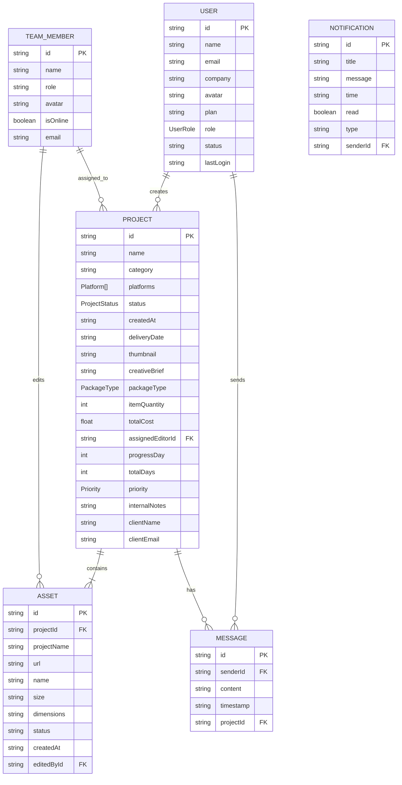

### 4.3 Interface Definitions

```typescript
interface User {
  id: string;
  name: string;
  email: string;
  company: string;
  avatar: string;
  plan: string;
  role: UserRole;
  status?: 'active' | 'inactive';
  lastLogin?: string;
}

interface Project {
  id: string;
  name: string;
  category: string;
  platforms: Platform[];
  status: ProjectStatus;
  createdAt: string;
  deliveryDate: string;
  thumbnail: string;
  creativeBrief: string;
  packageType: PackageType;
  itemQuantity: number;
  totalCost: number;
  assignedEditor?: TeamMember;
  progressDay?: number;
  totalDays?: number;
  // Admin fields
  priority?: Priority;
  internalNotes?: string;
  clientName?: string;
  clientEmail?: string;
  qaChecklist?: {
    imageQuality: boolean;
    briefCompliance: boolean;
    specsCheck: boolean;
  };
}

interface TeamMember {
  id: string;
  name: string;
  role: 'Lead Editor' | 'Account Manager' | 'QA Specialist' | 'Senior Retoucher';
  avatar: string;
  isOnline: boolean;
  email: string;
}

interface Asset {
  id: string;
  projectId: string;
  projectName: string;
  url: string;
  name: string;
  size: string;
  dimensions: string;
  status: 'pending' | 'approved' | 'revision';
  createdAt: string;
  editedBy?: TeamMember;
}

interface Notification {
  id: string;
  title: string;
  message: string;
  time: string;
  read: boolean;
  type: 'info' | 'success' | 'warning';
  sender?: TeamMember;
}

interface Message {
  id: string;
  sender: TeamMember | User;
  content: string;
  timestamp: string;
  projectId?: string;
}

interface AdminStats {
  revenue: number;
  completedProjects: number;
  avgTurnaround: number; // hours
  clientSatisfaction: number;
}
```

---

## 5. Authentication System

### 5.1 Magic Link Authentication Flow

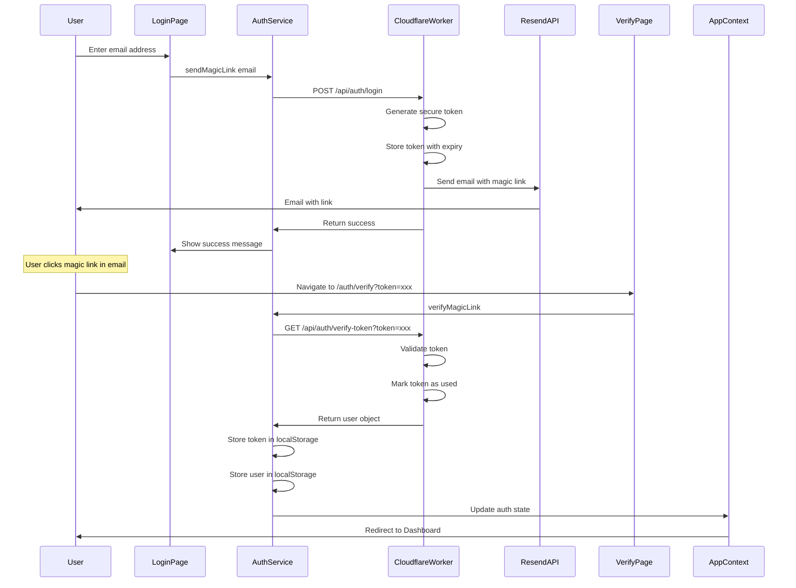

### 5.2 AuthService Implementation Details

```
File: authService.ts

Key Functions:
├── sendMagicLink(email: string): Promise<boolean>
│   └── POST /api/auth/login with email
├── verifyMagicLink(): Promise<User | null>
│   └── Extract token from URL hash
│   └── GET /api/auth/verify-token?token=xxx
│   └── Store session in localStorage
├── getCurrentUser(): User | null
│   └── Read from localStorage
├── logout(): void
│   └── Clear localStorage
├── addUser(userData): Promise<any>
│   └── POST /api/users
├── getAllUsers(): Promise<any>
│   └── GET /api/users
└── deleteUser(userId): Promise<any>
    └── DELETE /api/users/:id

Storage Keys:
├── TOKEN_KEY = 'modelmagic_auth_token'
└── USER_KEY = 'modelmagic_user_data'
```

### 5.3 Role-Based Access Control

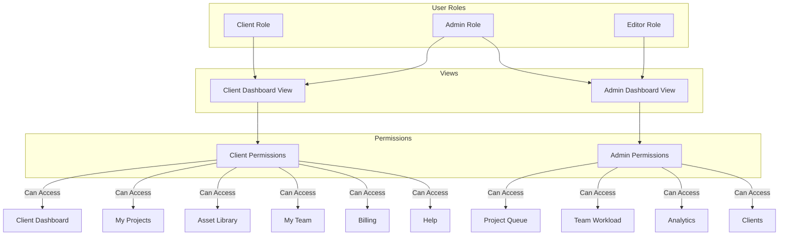

---

## 6. Routing & Navigation

### 6.1 Route Structure

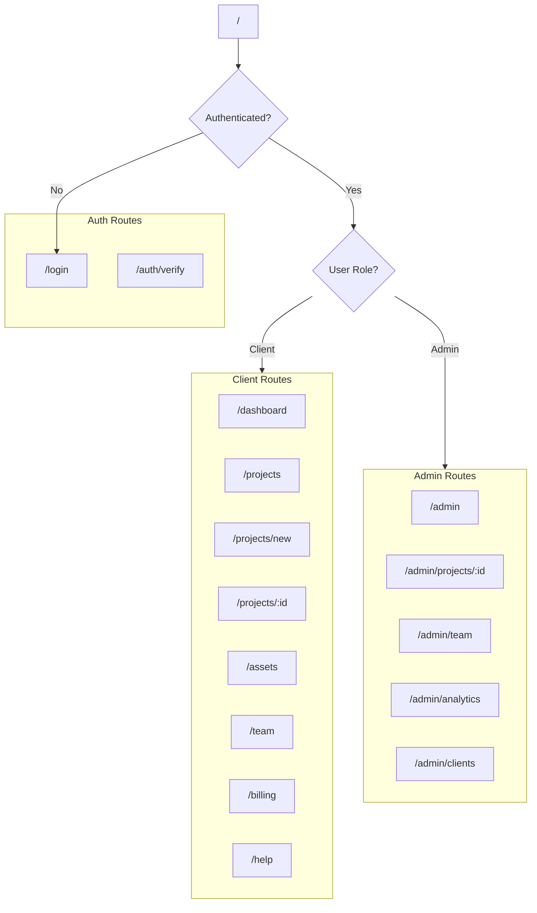

### 6.2 Route Definitions

| Route | Component | Access | Description |
|-------|-----------|--------|-------------|
| `/` | HomeRoute | Protected | Redirects based on role |
| `/login` | Login | Public | Magic link login page |
| `/auth/verify` | VerifyToken | Public | Token verification |
| `/dashboard` | Dashboard | Client | Client dashboard |
| `/projects` | ProjectsList | Client | List of projects |
| `/projects/new` | NewProject | Client | Create new project |
| `/projects/:id` | ProjectDetail | Client | Project details |
| `/assets` | AssetsPage | Client | Asset library |
| `/team` | TeamPage | Client | Team view |
| `/billing` | PlaceholderPage | Client | Billing page |
| `/help` | HelpPage | Client | Help & support |
| `/admin` | AdminDashboard | Admin | Project queue |
| `/admin/projects/:id` | AdminProjectDetail | Admin | Admin project view |
| `/admin/team` | AdminTeam | Admin | Team workload |
| `/admin/analytics` | AdminAnalytics | Admin | Analytics dashboard |
| `/admin/clients` | AdminClients | Admin | Client management |

### 6.3 Protected Route Component

```
ProtectedRoute Component:
├── Checks isAuthenticated from context
├── Checks isLoading state
├── If loading: Show loading spinner
├── If not authenticated: Redirect to /login
└── If authenticated: Render children
```

---

## 7. State Management

### 7.1 Context Architecture

```mermaid
flowchart TB
    subgraph AppContext
        subgraph AuthState
            user[user: User | null]
            isAuthenticated[isAuthenticated: boolean]
            isLoading[isLoading: boolean]
            userRole[userRole: UserRole]
        end

        subgraph DataState
            projects[projects: Project[]]
            assets[assets: Asset[]]
            notifications[notifications: Notification[]]
            teamMembers[teamMembers: TeamMember[]]
            messages[messages: Message[]]
        end

        subgraph Actions
            login[login]
            logout[logout]
            switchRole[switchRole]
            addProject[addProject]
            updateProject[updateProject]
            updateAssetStatus[updateAssetStatus]
            getProjectAssets[getProjectAssets]
        end
    end

    Components --> AppContext
    AppContext --> localStorage[(localStorage)]
    AppContext --> API[(API)]
```

### 7.2 Context Interface

```typescript
interface AppContextType {
  // Auth State
  user: User | null;
  isAuthenticated: boolean;
  isLoading: boolean;
  userRole: UserRole;
  
  // Data State
  projects: Project[];
  assets: Asset[];
  notifications: Notification[];
  teamMembers: TeamMember[];
  messages: Message[];
  
  // Auth Actions
  login: (email: string) => Promise<void>;
  logout: () => void;
  switchRole: (role: UserRole) => void;
  
  // Data Actions
  addProject: (project: Project) => void;
  updateProject: (projectId: string, updates: Partial<Project>) => void;
  updateAssetStatus: (assetId: string, status: 'approved' | 'revision') => void;
  getProjectAssets: (projectId: string) => Asset[];
}
```

### 7.3 State Flow

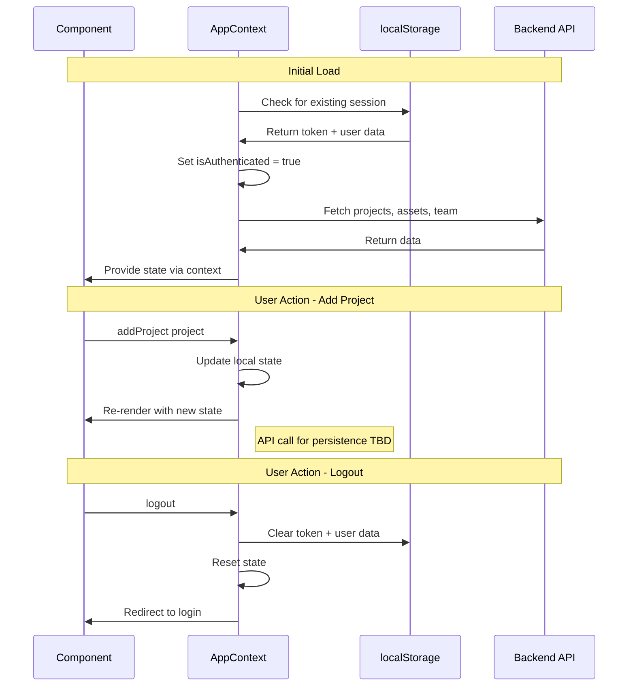

---

## 8. API Integration

### 8.1 API Endpoints

| Method | Endpoint | Description | Request Body | Response |
|--------|----------|-------------|--------------|----------|
| POST | `/api/auth/login` | Request magic link | `{ email: string }` | `{ success: boolean }` |
| GET | `/api/auth/verify-token` | Verify token | Query: `token` | `{ user: User, token: string }` |
| GET | `/api/projects` | List projects | - | `{ success: boolean, projects: Project[] }` |
| GET | `/api/assets` | List assets | - | `{ success: boolean, assets: Asset[] }` |
| GET | `/api/team-members` | List team | - | `{ success: boolean, team_members: TeamMember[] }` |
| GET | `/api/users` | List users | - | `{ success: boolean, users: User[] }` |
| POST | `/api/users` | Create user | `{ email, name, role, company?, sendInvite }` | `{ success: boolean, user: User }` |
| DELETE | `/api/users/:id` | Delete user | - | `{ success: boolean }` |

### 8.2 API Base URL Configuration

```
Environment Variables:
├── VITE_API_BASE_URL=https://api.modelsmagix.com
├── RESEND_API_KEY=your_resend_api_key_here
└── CLOUDFLARE_WORKER_URL=https://api.modelsmagix.com
```

### 8.3 API Response Patterns

```typescript
// Success Response
{
  success: true,
  data: { ... }
}

// Error Response
{
  success: false,
  error: "Error message"
}

// Paginated Response (future)
{
  success: true,
  data: [...],
  pagination: {
    page: 1,
    limit: 10,
    total: 100
  }
}
```

---

## 9. UI/UX Architecture

### 9.1 Component Hierarchy

```
App
├── AppProvider (Context)
│   └── Routes
│       ├── Login (Public)
│       ├── VerifyToken (Public)
│       └── ProtectedRoute
│           └── Layout
│               ├── Sidebar
│               │   ├── Logo
│               │   ├── Submit Project Button (Client)
│               │   ├── Navigation Items
│               │   └── User Profile
│               ├── Header
│               │   ├── Search Bar
│               │   ├── Notifications
│               │   └── Role Switcher (Admin)
│               └── Main Content
│                   └── Page Components
```

### 9.2 Design System

| Element | Value |
|---------|-------|
| Primary Color | `#1F6B55` (Green) |
| Primary Hover | `#164f3f` |
| Text Primary | `#1A1A1A` |
| Text Secondary | `#6B7280` |
| Text Muted | `#9CA3AF` |
| Background | `#F5F3F0` |
| Card Background | `#FFFFFF` |
| Border | `#E5E7EB` |
| Success | `#22C55E` |
| Warning | `#F59E0B` |
| Error | `#EF4444` |
| Font Family | System Sans-serif |

### 9.3 Page Layouts

```
Dashboard Layout:
├── Stats Cards Row
├── Projects Overview
├── Recent Activity
└── Quick Actions

Project Detail Layout:
├── Header with Status Badge
├── Project Info Section
├── Assets Gallery
├── Activity Timeline
└── Action Buttons

Admin Dashboard Layout:
├── Stats Overview
├── Project Queue Table
├── Filters & Search
└── Bulk Actions
```

---

## 10. CI/CD Pipeline & Deployment

### 10.1 GitHub Actions Workflow

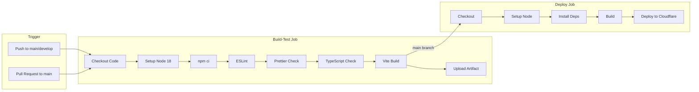

### 10.2 CI/CD Configuration

```yaml
# .github/workflows/ci.yml

Triggers:
  - Push to: main, develop
  - Pull Request to: main

Jobs:
  build-and-test:
    Steps:
      1. Checkout code
      2. Setup Node.js 18
      3. Install dependencies (npm ci)
      4. Run ESLint
      5. Check formatting (Prettier)
      6. TypeScript type check
      7. Build project
      8. Upload build artifacts

  deploy:
    Condition: main branch && push event
    Steps:
      1. Checkout code
      2. Setup Node.js 18
      3. Install dependencies
      4. Build project
      5. Deploy to Cloudflare Pages

Required Secrets:
  - CLOUDFLARE_API_TOKEN
  - CLOUDFLARE_ACCOUNT_ID
```

### 10.3 Deployment Architecture

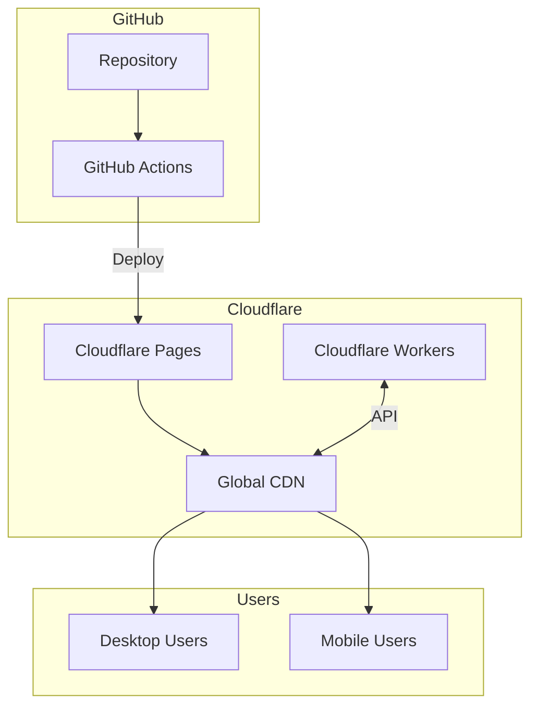

---

## 11. Current Implementation Status

### 11.1 Frontend Status

| Component | Status | Notes |
|-----------|--------|-------|
| Project Structure | ✅ Complete | Well-organized |
| TypeScript Types | ✅ Complete | Full type coverage |
| React Router Setup | ✅ Complete | HashRouter implementation |
| Context API | ✅ Complete | Auth + Data state |
| Authentication UI | ✅ Complete | Login + Verify pages |
| Client Dashboard | ✅ Complete | Full implementation |
| Client Projects | ✅ Complete | List + Detail + New |
| Client Assets | ✅ Complete | Asset library |
| Client Team | ✅ Complete | Team view |
| Admin Dashboard | ✅ Complete | Project queue |
| Admin Team | ✅ Complete | Team workload |
| Admin Analytics | ✅ Complete | Analytics view |
| Admin Clients | ✅ Complete | Client management |
| Layout Component | ✅ Complete | Responsive sidebar |
| Role Switcher | ✅ Complete | Admin view toggle |
| ESLint Config | ✅ Complete | TypeScript rules |
| Prettier Config | ✅ Complete | Code formatting |
| CI/CD Pipeline | ✅ Complete | GitHub Actions |

### 11.2 Backend Status (Cloudflare Workers)

| Endpoint | Status | Notes |
|----------|--------|-------|
| Auth - Login | ⚠️ Needs Review | Magic link sending |
| Auth - Verify | ⚠️ Needs Review | Token verification |
| Projects - CRUD | ⚠️ Partial | GET implemented |
| Assets - CRUD | ⚠️ Partial | GET implemented |
| Users - CRUD | ⚠️ Partial | Basic CRUD |
| Team Members | ⚠️ Partial | GET implemented |

### 11.3 Known Gaps

1. **Backend API Completeness** - Need full CRUD for all entities
2. **Data Persistence** - Projects/Assets created locally not persisted
3. **File Upload** - No actual file upload implementation
4. **Real-time Updates** - No WebSocket/SSE for live updates
5. **Billing Integration** - Placeholder page only
6. **Error Handling** - Limited error boundary implementation
7. **Testing** - No test suite implemented
8. **Accessibility** - Limited ARIA labels
9. **Offline Support** - No service worker/PWA features
10. **Performance** - No code splitting/lazy loading

---

## 12. Step-by-Step Implementation Plan

### Phase 1: Backend API Completion (Priority: Critical)

**Duration: 2-3 weeks**

#### Step 1.1: Set Up Cloudflare Workers Development Environment
```
Tasks:
□ Install Wrangler CLI
□ Configure wrangler.toml
□ Set up D1 database schema
□ Configure KV namespaces for sessions
□ Set up environment variables
```

#### Step 1.2: Implement Authentication API
```
Tasks:
□ POST /api/auth/login
  - Validate email format
  - Generate secure token (crypto.randomUUID)
  - Store token in KV with 15-min expiry
  - Send email via Resend API
  
□ GET /api/auth/verify-token
  - Validate token exists in KV
  - Lookup user by token
  - Create session
  - Return user object
  - Mark token as used
```

#### Step 1.3: Implement Projects API
```
Tasks:
□ GET /api/projects
  - List all projects for user
  - Filter by status
  - Pagination support
  
□ GET /api/projects/:id
  - Get single project with assets
  
□ POST /api/projects
  - Create new project
  - Validate required fields
  - Auto-set status to SUBMITTED
  
□ PUT /api/projects/:id
  - Update project fields
  - Handle status transitions
  
□ DELETE /api/projects/:id
  - Soft delete project
```

#### Step 1.4: Implement Assets API
```
Tasks:
□ GET /api/assets
  - List assets by project
  - Filter by status
  
□ POST /api/assets
  - Upload asset metadata
  - Generate presigned URL for R2
  
□ PUT /api/assets/:id
  - Update asset status
  - Update metadata
  
□ DELETE /api/assets/:id
  - Remove asset
```

#### Step 1.5: Implement Users API
```
Tasks:
□ Complete CRUD operations
□ Add role management
□ Implement invite flow
□ Add user deactivation
```

### Phase 2: Frontend Enhancements (Priority: High)

**Duration: 2 weeks**

#### Step 2.1: Connect Frontend to Real API
```
Tasks:
□ Replace mock data with API calls
□ Implement loading states
□ Add error handling
□ Add retry logic
□ Implement optimistic updates
```

#### Step 2.2: Implement File Upload
```
Tasks:
□ Add drag-and-drop upload component
□ Implement presigned URL upload to R2
□ Add upload progress indicator
□ Implement file validation
□ Add thumbnail generation
```

#### Step 2.3: Add Real-time Features
```
Tasks:
□ Set up Server-Sent Events
□ Implement notification updates
□ Add project status live updates
□ Show online status for team
```

#### Step 2.4: Implement Billing Page
```
Tasks:
□ Design billing UI
□ Add Stripe integration (future)
□ Show usage statistics
□ Implement plan management
```

### Phase 3: Quality & Performance (Priority: Medium)

**Duration: 1-2 weeks**

#### Step 3.1: Add Testing
```
Tasks:
□ Set up Vitest for unit tests
□ Add React Testing Library
□ Write component tests
□ Add integration tests
□ Set up E2E with Playwright
```

#### Step 3.2: Performance Optimization
```
Tasks:
□ Implement route-based code splitting
□ Add React.lazy for pages
□ Optimize images with srcset
□ Add virtual scrolling for lists
□ Implement memo for expensive renders
```

#### Step 3.3: Accessibility
```
Tasks:
□ Add ARIA labels
□ Implement keyboard navigation
□ Add skip links
□ Test with screen reader
□ Ensure color contrast
```

#### Step 3.4: Error Handling
```
Tasks:
□ Add Error Boundary component
□ Implement toast notifications
□ Add retry mechanisms
□ Create error logging service
```

### Phase 4: Advanced Features (Priority: Low)

**Duration: 2-3 weeks**

#### Step 4.1: PWA Support
```
Tasks:
□ Add service worker
□ Implement offline mode
□ Add install prompt
□ Configure manifest.json
```

#### Step 4.2: Analytics Integration
```
Tasks:
□ Set up Google Analytics
□ Implement event tracking
□ Add conversion tracking
□ Create custom dashboards
```

#### Step 4.3: Advanced Admin Features
```
Tasks:
□ Bulk project actions
□ Advanced filtering
□ Export functionality
□ Audit logging
```

---

## 13. Appendices

### Appendix A: File Structure Reference

```
modelmagic-dashboard/
├── .github/
│   └── workflows/
│       └── ci.yml              # CI/CD pipeline
├── components/
│   ├── AddUserModal.tsx        # User management modal
│   ├── Layout.tsx              # Main layout wrapper
│   └── ProtectedRoute.tsx      # Auth guard component
├── pages/
│   ├── admin/
│   │   ├── AdminAnalytics.tsx  # Analytics dashboard
│   │   ├── AdminClients.tsx    # Client management
│   │   ├── AdminDashboard.tsx  # Admin project queue
│   │   ├── AdminProjectDetail.tsx
│   │   └── AdminTeam.tsx       # Team workload
│   ├── Assets.tsx              # Asset library
│   ├── Dashboard.tsx           # Client dashboard
│   ├── Help.tsx                # Help & support
│   ├── Login.tsx               # Login page
│   ├── NewProject.tsx          # Create project
│   ├── ProjectDetail.tsx       # Project details
│   ├── Team.tsx                # Client team view
│   └── VerifyToken.tsx         # Magic link verify
├── public/                     # Static assets
├── .env.example                # Env template
├── .eslintrc.json              # ESLint config
├── .prettierrc                 # Prettier config
├── App.tsx                     # Main app + routing
├── authService.ts              # Auth utilities
├── context.tsx                 # Global state
├── index.html                  # HTML entry
├── index.tsx                   # React entry
├── mockData.ts                 # Mock data
├── package.json                # Dependencies
├── tsconfig.json               # TypeScript config
├── types.ts                    # Type definitions
└── vite.config.ts              # Vite config
```

### Appendix B: Environment Setup Guide

```bash
# 1. Clone repository
git clone https://github.com/jalaura/modelmagic-dashboard.git
cd modelmagic-dashboard

# 2. Install dependencies
npm install

# 3. Configure environment
cp .env.example .env
# Edit .env with your values

# 4. Start development server
npm run dev

# 5. Run linting
npm run lint

# 6. Build for production
npm run build
```

### Appendix C: API Documentation Template

```
Endpoint: POST /api/auth/login
Purpose: Request magic link authentication
Request:
  Headers:
    Content-Type: application/json
  Body:
    {
      "email": "user@example.com"
    }
Response:
  Success (200):
    {
      "success": true,
      "message": "Magic link sent"
    }
  Error (400):
    {
      "success": false,
      "error": "Invalid email format"
    }
  Error (429):
    {
      "success": false,
      "error": "Too many requests"
    }
```

### Appendix D: Database Schema (D1)

```sql
-- Users table
CREATE TABLE users (
  id TEXT PRIMARY KEY,
  email TEXT UNIQUE NOT NULL,
  name TEXT NOT NULL,
  company TEXT,
  avatar TEXT,
  plan TEXT DEFAULT 'Starter',
  role TEXT DEFAULT 'client',
  status TEXT DEFAULT 'active',
  created_at DATETIME DEFAULT CURRENT_TIMESTAMP,
  last_login DATETIME
);

-- Projects table
CREATE TABLE projects (
  id TEXT PRIMARY KEY,
  user_id TEXT NOT NULL,
  name TEXT NOT NULL,
  category TEXT,
  platforms TEXT, -- JSON array
  status TEXT DEFAULT 'Draft',
  created_at DATETIME DEFAULT CURRENT_TIMESTAMP,
  delivery_date DATE,
  thumbnail TEXT,
  creative_brief TEXT,
  package_type TEXT,
  item_quantity INTEGER DEFAULT 1,
  total_cost REAL,
  assigned_editor_id TEXT,
  progress_day INTEGER,
  total_days INTEGER,
  priority TEXT DEFAULT 'Standard',
  internal_notes TEXT,
  FOREIGN KEY (user_id) REFERENCES users(id),
  FOREIGN KEY (assigned_editor_id) REFERENCES team_members(id)
);

-- Assets table
CREATE TABLE assets (
  id TEXT PRIMARY KEY,
  project_id TEXT NOT NULL,
  url TEXT NOT NULL,
  name TEXT NOT NULL,
  size TEXT,
  dimensions TEXT,
  status TEXT DEFAULT 'pending',
  created_at DATETIME DEFAULT CURRENT_TIMESTAMP,
  edited_by_id TEXT,
  FOREIGN KEY (project_id) REFERENCES projects(id),
  FOREIGN KEY (edited_by_id) REFERENCES team_members(id)
);

-- Team members table
CREATE TABLE team_members (
  id TEXT PRIMARY KEY,
  name TEXT NOT NULL,
  role TEXT NOT NULL,
  avatar TEXT,
  is_online BOOLEAN DEFAULT FALSE,
  email TEXT UNIQUE NOT NULL
);

-- Magic tokens table (for KV backup)
CREATE TABLE magic_tokens (
  token TEXT PRIMARY KEY,
  email TEXT NOT NULL,
  created_at DATETIME DEFAULT CURRENT_TIMESTAMP,
  expires_at DATETIME NOT NULL,
  used BOOLEAN DEFAULT FALSE
);
```

---

## 14. Third-Party Integrations

### 14.1 Current Integrations

| Service | Purpose | Status |
|---------|---------|--------|
| **Resend** | Magic link email authentication | ✅ Integrated |
| **Cloudflare Pages** | Static site hosting | ✅ Integrated |
| **Cloudflare Workers** | Serverless API | ✅ Integrated |
| **GitHub Actions** | CI/CD pipeline | ✅ Integrated |

### 14.2 Recommended Integrations

#### Payment Processing

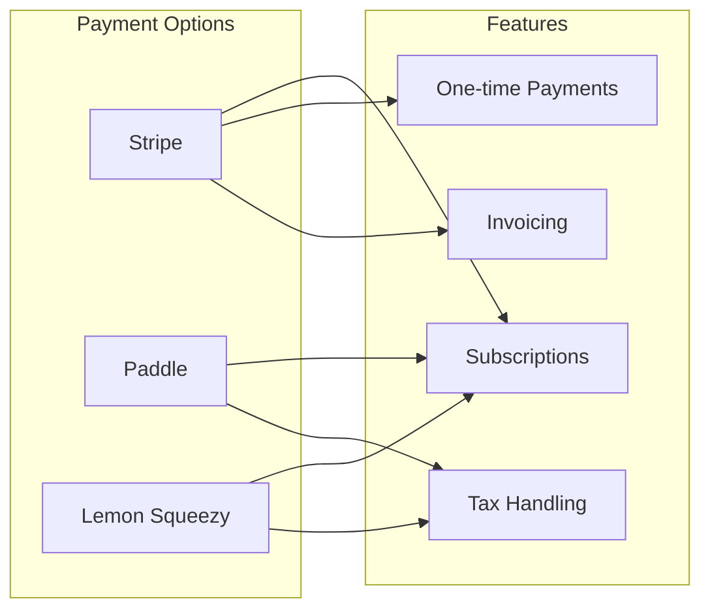

| Service | Best For | Pricing | Notes |
|---------|----------|---------|-------|
| **Stripe** | Full control, US-based | 2.9% + $0.30 | Industry standard, extensive API |
| **Paddle** | SaaS, global tax compliance | 5% + $0.50 | Handles VAT/GST automatically |
| **Lemon Squeezy** | Digital products, simplicity | 5% + $0.50 | Built-in tax handling, simpler setup |

**Recommendation:** Stripe for maximum flexibility and control

#### File Storage

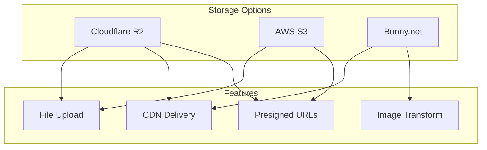

| Service | Best For | Pricing | Notes |
|---------|----------|---------|-------|
| **Cloudflare R2** | Cloudflare ecosystem | $0.015/GB/mo, free egress | Best fit for current stack |
| **AWS S3** | Enterprise, complex workflows | $0.023/GB/mo + egress | More features, higher complexity |
| **Bunny.net** | Image-heavy, global delivery | $0.01/GB/mo | Excellent CDN, image optimization |

**Recommendation:** Cloudflare R2 for seamless integration

#### Analytics & Monitoring

| Service | Purpose | Pricing | Integration Effort |
|---------|---------|---------|-------------------|
| **Plausible** | Privacy-focused analytics | $9/mo | Low - script tag |
| **PostHog** | Product analytics + session replay | Free tier available | Medium - SDK |
| **Sentry** | Error tracking | Free tier available | Low - SDK |
| **LogRocket** | Session replay + debugging | $99/mo | Medium - SDK |

**Recommendation:** Plausible + Sentry for privacy and error tracking

#### Communication & Support

| Service | Purpose | Pricing | Notes |
|---------|---------|---------|-------|
| **Intercom** | Live chat + help center | $74/mo | Premium but comprehensive |
| **Crisp** | Live chat | Free tier | Good alternative to Intercom |
| **Zendesk** | Full ticketing system | $19/agent/mo | Enterprise-grade |
| **Plain** | Customer support platform | $29/mo | Modern, API-first |

**Recommendation:** Crisp for cost-effective live chat

#### Email Services

| Service | Purpose | Pricing | Notes |
|---------|----------|---------|-------|
| **Resend** | Transactional email | 3,000 free/mo | Already integrated |
| **Postmark** | High deliverability | $10/mo | Best for transactional |
| **SendGrid** | Marketing + transactional | Free tier | Full email platform |
| **Customer.io** | Email automation | $100/mo | Advanced workflows |

**Recommendation:** Keep Resend, add Customer.io for marketing automation

### 14.3 Integration Architecture

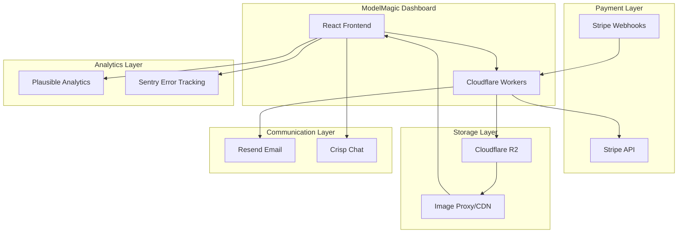

### 14.4 Integration Priority Matrix

| Integration | Priority | Effort | Impact | Phase |
|-------------|----------|--------|--------|-------|
| Cloudflare R2 | Critical | Medium | High | Phase 1 |
| Stripe | Critical | High | High | Phase 2 |
| Sentry | High | Low | Medium | Phase 1 |
| Plausible | Medium | Low | Medium | Phase 2 |
| Crisp | Medium | Low | Medium | Phase 3 |
| Customer.io | Low | Medium | Medium | Phase 4 |

### 14.5 Integration Implementation Guide

#### Stripe Integration Steps

```
1. Create Stripe account and get API keys
2. Install Stripe SDK: npm install stripe @stripe/stripe-js
3. Create pricing page with Stripe Price IDs
4. Implement checkout session creation in Worker
5. Set up webhook endpoint for payment events
6. Handle subscription lifecycle events
7. Store subscription status in database
8. Add billing portal redirect
```

**Worker Webhook Handler Pattern:**
```typescript
// POST /api/webhooks/stripe
async function handleStripeWebhook(request: Request) {
  const signature = request.headers.get('stripe-signature');
  const body = await request.text();
  
  // Verify webhook signature
  const event = stripe.webhooks.constructEvent(
    body,
    signature,
    STRIPE_WEBHOOK_SECRET
  );
  
  switch (event.type) {
    case 'checkout.session.completed':
      // Activate subscription
      break;
    case 'invoice.payment_failed':
      // Handle failed payment
      break;
    case 'customer.subscription.deleted':
      // Deactivate account
      break;
  }
}
```

#### Cloudflare R2 Integration Steps

```
1. Create R2 bucket in Cloudflare dashboard
2. Generate API tokens with R2 permissions
3. Implement presigned URL generation in Worker
4. Create upload component in frontend
5. Handle multipart uploads for large files
6. Set up lifecycle rules for temporary files
7. Configure CORS for browser uploads
```

**Presigned URL Pattern:**
```typescript
// POST /api/upload/presign
async function generatePresignedUrl(request: Request) {
  const { filename, contentType } = await request.json();
  const key = `uploads/${crypto.randomUUID()}/${filename}`;
  
  const url = await getSignedUrl(r2, new PutObjectCommand({
    Bucket: 'modelmagic-assets',
    Key: key,
    ContentType: contentType,
  }), { expiresIn: 3600 });
  
  return { uploadUrl: url, key };
}
```

#### Sentry Integration Steps

```
1. Create Sentry project
2. Install SDK: npm install @sentry/react
3. Initialize in index.tsx with DSN
4. Add Error Boundary component
5. Configure source maps upload in CI
6. Set up release tracking
```

**Initialization Code:**
```typescript
import * as Sentry from '@sentry/react';

Sentry.init({
  dsn: import.meta.env.VITE_SENTRY_DSN,
  environment: import.meta.env.MODE,
  integrations: [
    new Sentry.BrowserTracing(),
    new Sentry.Replay(),
  ],
  tracesSampleRate: 0.1,
  replaysSessionSampleRate: 0.1,
});
```

### 14.6 Cost Estimation for Integrations

| Service | Monthly Cost (Estimated) | Notes |
|---------|-------------------------|-------|
| Cloudflare R2 | $5-15 | 50-100GB storage |
| Stripe | 2.9% + $0.30/txn | Variable |
| Sentry | $0 (free tier) | 5k errors/mo |
| Plausible | $9 | 10k pageviews |
| Crisp | $0 (free tier) | Basic features |
| **Total Base** | **~$14-24/mo** | Excluding Stripe fees |

---

## Summary

This architecture document provides a comprehensive overview of the ModelMagic Dashboard application. The frontend is well-structured and largely complete, with the primary gaps being in backend API completion and advanced features.

**Key Priorities for Implementation:**

1. **Complete Backend API** - Critical for production readiness
2. **File Upload Flow** - Essential for the core product functionality
3. **Error Handling** - Important for user experience
4. **Testing** - Important for maintainability
5. **Performance** - Important for scale

The implementation plan is designed to be executed in phases, allowing for iterative delivery and continuous feedback.

**Recommended Integration Stack:**
- **Payment:** Stripe
- **Storage:** Cloudflare R2
- **Analytics:** Plausible + Sentry
- **Communication:** Crisp + Resend

---

*Document prepared for the ModelMagic Dashboard development team.*